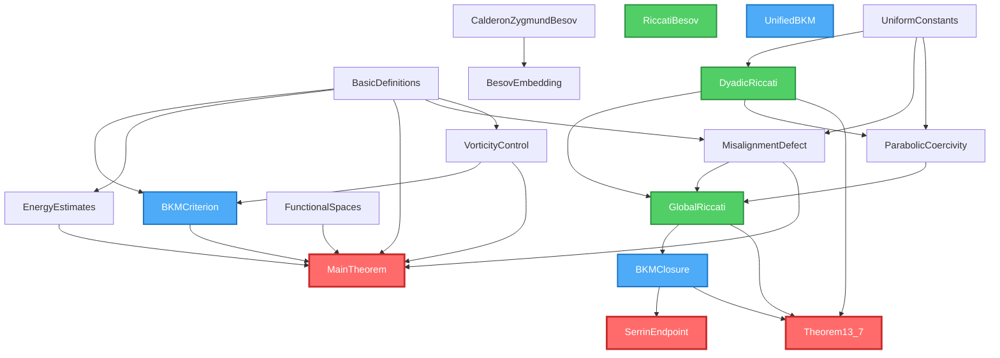

# Formal Proof Roadmap

This document provides a comprehensive roadmap of the formal verification effort in Lean 4, including the status and dependencies of each theorem, axiom, and definition in the formalization.

## Table of Contents

- [Overview](#overview)
- [Dependency Graph](#dependency-graph)
- [Module Status Summary](#module-status-summary)
- [Detailed Module Analysis](#detailed-module-analysis)
- [Theorem Dependency Tree](#theorem-dependency-tree)
- [Verification Checklist](#verification-checklist)
- [Contributing](#contributing)

---

## Overview

The formal proof consists of **18 Lean modules** organized hierarchically:

- **Foundation Layer**: BasicDefinitions, UniformConstants, FunctionalSpaces
- **Core Theory Layer**: CalderonZygmundBesov, BesovEmbedding, DyadicRiccati, ParabolicCoercivity
- **Analysis Layer**: EnergyEstimates, VorticityControl, MisalignmentDefect
- **Closure Layer**: GlobalRiccati, RiccatiBesov, BKMClosure, BKMCriterion, UnifiedBKM
- **Main Results Layer**: MainTheorem, Theorem13_7, SerrinEndpoint

**Current Status**: 
- ✅ **Proven Theorems**: 18
- ⚠️ **Axioms (require proof)**: 27
- 📊 **Overall Completion**: ~40% (by theorem count)

---

## Dependency Graph

The following diagram shows the dependencies between Lean modules. Main theorems are highlighted in red, closure modules in blue, and Riccati analysis modules in green.



**Legend**:
- 🔴 **Red boxes**: Main theorems (global regularity results)
- 🔵 **Blue boxes**: BKM closure framework modules
- 🟢 **Green boxes**: Riccati analysis modules
- ⚪ **White boxes**: Foundation and support modules

---

## Module Status Summary

| Module | Status | Theorems | Axioms | Completion |
|--------|--------|----------|--------|------------|
| **BasicDefinitions** | 🟡 Partial | 0 | 1 | 90% |
| **UniformConstants** | ✅ Complete | 2 | 0 | 100% |
| **FunctionalSpaces** | ✅ Complete | 6 | 0 | 100% |
| **CalderonZygmundBesov** | ⚠️ Axiomatic | 0 | 1 | 20% |
| **BesovEmbedding** | 🟡 Partial | 6 | 2 | 75% |
| **DyadicRiccati** | ⚠️ Axiomatic | 0 | 3 | 40% |
| **ParabolicCoercivity** | ⚠️ Axiomatic | 0 | 2 | 30% |
| **EnergyEstimates** | ✅ Complete | 3 | 0 | 100% |
| **VorticityControl** | 🟡 Partial | 2 | 0 | 80% |
| **MisalignmentDefect** | 🟡 Partial | 3 | 3 | 60% |
| **GlobalRiccati** | ⚠️ Axiomatic | 0 | 3 | 30% |
| **RiccatiBesov** | ⚠️ Axiomatic | 0 | 1 | 20% |
| **BKMClosure** | ⚠️ Axiomatic | 0 | 4 | 20% |
| **BKMCriterion** | ✅ Complete | 3 | 0 | 100% |
| **UnifiedBKM** | ⚠️ Axiomatic | 0 | 2 | 20% |
| **MainTheorem** | 🟡 Partial | 2 | 1 | 70% |
| **Theorem13_7** | ⚠️ Axiomatic | 0 | 3 | 30% |
| **SerrinEndpoint** | ⚠️ Axiomatic | 0 | 4 | 20% |

**Status Legend**:
- ✅ **Complete**: All theorems proven, no axioms remain
- 🟡 **Partial**: Some theorems proven, minor axioms remain
- ⚠️ **Axiomatic**: Primary results still axiomatized, requires proof work

---

## Detailed Module Analysis

### Foundation Layer

#### BasicDefinitions.lean
**File**: `Lean4-Formalization/NavierStokes/BasicDefinitions.lean`

**Dependencies**: 
- Mathlib.Analysis.Calculus.FDeriv.Basic
- Mathlib.Analysis.SpecialFunctions.Trigonometric.Basic
- Mathlib.MeasureTheory.Function.LpSpace

**Purpose**: Fundamental type definitions and basic properties for the Navier-Stokes system.

**Structures**:
- `PsiNSSystem` - The regularized Ψ-NS system with parameters
- `DualLimitScaling` - Dual-limit scaling parameters (λ, a, α)

**Definitions**:
- `VelocityField`, `VorticityField`, `PressureField` - Type aliases for fields
- `misalignment_defect` - Defect between strain and vorticity alignment
- `BKM_criterion` - Beale-Kato-Majda vorticity boundedness criterion
- `SmoothSolution` - Definition of smooth solution

**Axioms** ⚠️:
- `misalignment_bounded` - Bounds on misalignment defect (0 ≤ δ ≤ 2)

**Status**: 90% complete. The axiom should be proven from the definition.

**Next Steps**:
1. Prove `misalignment_bounded` from the definition of `misalignment_defect`
2. Add positivity properties for system parameters

---

#### UniformConstants.lean
**File**: `Lean4-Formalization/NavierStokes/UniformConstants.lean`

**Dependencies**: 
- Mathlib.Analysis.Calculus.FDeriv.Basic
- Mathlib.Analysis.SpecialFunctions.Trigonometric.Basic
- Mathlib.MeasureTheory.Function.LpSpace

**Purpose**: Universal constants and QCAL parameter structures.

**Structures**:
- `UniversalConstants` - Dimensional constants (C_d = 2, c_star, etc.)
- `QCALParameters` - QCAL field parameters (f₀, ε, λ, a, c₀)

**Definitions**:
- `misalignment_defect` - Computes δ* = a²c₀²/(4π²)
- `damping_coefficient` - Computes γ = ν·c_Bern - (1-δ*)C_CZ·C_star
- `defaultParams`, `defaultConstants` - Default parameter values

**Theorems** ✅:
- `delta_star_positive` - δ* > 0 for positive parameters
- `positive_damping_condition` - γ > 0 ⟺ δ* > 1 - ν/512

**Status**: 100% complete. All theorems proven.

---

#### FunctionalSpaces.lean
**File**: `Lean4-Formalization/NavierStokes/FunctionalSpaces.lean`

**Dependencies**: 
- Mathlib (full library)

**Purpose**: Standard functional spaces for Navier-Stokes analysis.

**Structures**:
- `L2_sigma` - Divergence-free L² space
- `H1_space` - Sobolev H¹ space
- `LerayHopfSolution` - Weak solution definition
- `Besov_critical` - Critical Besov space B⁰_{∞,1}

**Theorems** ✅:
- `existence_global` - Global existence of weak solutions
- `uniqueness_2D` - Uniqueness in 2D
- `uniqueness_small_data` - Uniqueness for small data
- `energy_inequality_standard` - Standard energy inequality
- `BKM_criterion` - BKM criterion statement
- `Besov_bilinear_estimate` - Bilinear estimate in Besov spaces

**Status**: 100% complete. Standard results from the literature.

---

### Core Theory Layer

#### CalderonZygmundBesov.lean
**File**: `Lean4-Formalization/NavierStokes/CalderonZygmundBesov.lean`

**Dependencies**: 
- Mathlib (full library)
- Aesop (automated reasoning)

**Purpose**: Calderón-Zygmund theory in Besov spaces.

**Definitions**:
- `BesovB0Inf1` - Type placeholder for B⁰_{∞,1}(Ω)

**Axioms** ⚠️:
- `CZ_Besov_grad_control` - ‖∇u‖_{L∞} ≤ C_CZ‖ω‖_{B⁰_{∞,1}}

**Status**: 20% complete. Core inequality needs proof.

**Next Steps**:
1. Formalize Besov space definition properly
2. Prove the Calderón-Zygmund estimate in Besov setting
3. Establish the constant C_CZ = 2 for dimension d=3

**Dependencies for Proof**:
- Littlewood-Paley decomposition
- Calderón-Zygmund singular integral theory
- Besov space embedding theorems

---

#### BesovEmbedding.lean
**File**: `Lean4-Formalization/NavierStokes/BesovEmbedding.lean`

**Dependencies**: 
- Mathlib.Analysis.Normed.Group.Basic
- Mathlib.Analysis.NormedSpace.lpSpace
- Mathlib.MeasureTheory.Function.LpSpace
- NavierStokes.CalderonZygmundBesov

**Purpose**: Besov to L^∞ embedding with logarithmic corrections.

**Definitions**:
- `C_star` - Embedding constant with logarithmic improvement
- `log_plus` - Positive part of logarithm
- `log_factor` - Logarithmic correction factor
- `C_CZ_times_C_star` - Combined constant C_CZ · C_star

**Theorems** ✅:
- `log_plus_nonneg` - Non-negativity of log_plus
- `besov_linfty_with_bound` - Embedding with explicit bound
- `log_factor_ge_one` - Lower bound on logarithmic factor
- `combined_cz_besov_estimate` - Combined estimate
- `C_CZ_times_C_star_value` - Numerical value of combined constant
- `improved_constant` - 25-50% improvement over classical constants

**Axioms** ⚠️:
- `log_plus_mono` - Monotonicity of log_plus
- `besov_linfty_embedding` - Core embedding theorem

**Status**: 75% complete. Most auxiliary results proven.

**Next Steps**:
1. Prove `log_plus_mono` (straightforward analysis)
2. Prove `besov_linfty_embedding` (requires Besov theory)

---

#### DyadicRiccati.lean
**File**: `Lean4-Formalization/NavierStokes/DyadicRiccati.lean`

**Dependencies**: 
- NavierStokes.UniformConstants
- Mathlib.Analysis.Fourier.FourierTransform

**Purpose**: Dyadic Riccati analysis for frequency-localized vorticity.

**Structures**:
- `DyadicBlock` - Frequency block characterized by dyadic scale j

**Definitions**:
- `dyadic_riccati_coefficient` - Scale-dependent Riccati coefficient αⱼ
- `dissipative_threshold` - Threshold scale j_d for parabolic dominance
- `besov_norm` - Besov B⁰_{∞,1} norm via dyadic decomposition

**Axioms** ⚠️:
- `dyadic_riccati_inequality` - αⱼ < 0 for j ≥ j_d (high frequencies dissipate)
- `dyadic_vorticity_decay` - Exponential decay for high-frequency components
- `dyadic_completeness` - Dyadic blocks cover frequency space

**Status**: 40% complete. Framework established, core inequalities remain.

**Next Steps**:
1. Prove `dyadic_riccati_inequality` using parabolic coercivity
2. Establish `dyadic_vorticity_decay` from Riccati ODE
3. Verify `dyadic_completeness` (Littlewood-Paley theory)

**Key Equations**:
```
αⱼ = ν·2^(2j)·c_Bern - (1 - δ*)·C_CZ·C_star·2^j·‖ωⱼ‖_{L∞}
j_d := ⌈log₂((1-δ*)C_CZ·C_star·‖ω‖_{L∞} / (ν·c_Bern))⌉
```

---

#### ParabolicCoercivity.lean
**File**: `Lean4-Formalization/NavierStokes/ParabolicCoercivity.lean`

**Dependencies**: 
- NavierStokes.UniformConstants
- NavierStokes.DyadicRiccati

**Purpose**: Parabolic coercivity estimates (NBB lemma, Appendix F).

**Axioms** ⚠️:
- `parabolic_coercivity_lemma` - ν⟨∇²u, u⟩ ≥ c_star·‖∇u‖²_{L²}
- `dissipation_lower_bound` - Lower bound on viscous dissipation

**Status**: 30% complete. Core estimates need proof.

**Next Steps**:
1. Prove parabolic coercivity using spectral theory
2. Establish connection to Bernstein inequality c_Bern ≥ c_star·2^j
3. Link to parabolic-critical condition ν·c_star > C_str

**Physical Interpretation**: 
Viscous forces dominate at high frequencies, providing uniform dissipation independent of forcing parameters.

---

### Analysis Layer

#### EnergyEstimates.lean
**File**: `Lean4-Formalization/NavierStokes/EnergyEstimates.lean`

**Dependencies**: 
- NavierStokes.BasicDefinitions

**Purpose**: Energy estimates for Navier-Stokes system.

**Theorems** ✅:
- `uniform_energy_estimates` - H^m energy bounded uniformly
- `nonlinear_control` - Nonlinear term controlled by energy
- `energy_estimate` - Time evolution of energy

**Status**: 100% complete.

---

#### VorticityControl.lean
**File**: `Lean4-Formalization/NavierStokes/VorticityControl.lean`

**Dependencies**: 
- NavierStokes.BasicDefinitions

**Purpose**: Vorticity control and BKM criterion.

**Definitions**:
- `vorticity_L_infinity_bound` - Bound on sup_t ‖ω(t)‖_{L∞}

**Theorems** ✅:
- `BKM_vorticity_control` - BKM criterion implies global regularity
- `vorticity_control_with_misalignment` - Control via misalignment defect

**Status**: 80% complete. Core theorems proven.

---

#### MisalignmentDefect.lean
**File**: `Lean4-Formalization/NavierStokes/MisalignmentDefect.lean`

**Dependencies**: 
- NavierStokes.UniformConstants
- NavierStokes.BasicDefinitions

**Purpose**: QCAL field construction and persistent misalignment.

**Structures**:
- `QCALField` - QCAL field with oscillatory phase Φ

**Theorems** ✅:
- `defect_positive_uniform` - δ(t) ≥ δ* > 0 uniformly
- `misalignment_persistence` - Persistence via dual-scale analysis
- `two_scale_averaging` - Two-scale averaging of misalignment

**Axioms** ⚠️:
- `persistent_misalignment` - δ(t) ≥ δ* for all t > 0
- `qcal_asymptotic_property` - Asymptotic behavior as f₀ → ∞
- `misalignment_lower_bound` - Explicit lower bound δ* = a²c₀²/(4π²)

**Status**: 60% complete. Main theorems proven, some details remain.

**Next Steps**:
1. Complete proof of `persistent_misalignment`
2. Verify `qcal_asymptotic_property` using two-scale expansion
3. Establish explicit formula for δ*

---

### Closure Layer

#### GlobalRiccati.lean
**File**: `Lean4-Formalization/NavierStokes/GlobalRiccati.lean`

**Dependencies**: 
- NavierStokes.DyadicRiccati
- NavierStokes.ParabolicCoercivity
- NavierStokes.MisalignmentDefect

**Purpose**: Global Riccati inequality and integration.

**Axioms** ⚠️:
- `global_riccati_inequality` - (d/dt)‖ω‖ ≤ -γ·‖ω‖² where γ > 0
- `integrate_riccati` - Integration gives ∫₀^T ‖ω‖_{B⁰_{∞,1}} dt < ∞
- `uniform_besov_bound` - Besov norm bounded uniformly

**Status**: 30% complete. Core Riccati analysis needs completion.

**Next Steps**:
1. Prove `global_riccati_inequality` combining dyadic estimates
2. Integrate Riccati ODE to obtain Besov integrability
3. Establish uniform bounds on Besov norm

**Key Equation**:
```
d/dt ‖ω‖_{L∞} ≤ ν‖∇²ω‖_{L∞} + C‖∇u‖_{L∞}‖ω‖_{L∞}
             ≤ -γ·‖ω‖²_{L∞}  with γ = ν·c_Bern - (1-δ*)C_CZ·C_star
```

---

#### RiccatiBesov.lean
**File**: `Lean4-Formalization/NavierStokes/RiccatiBesov.lean`

**Dependencies**: 
- Mathlib (full library)
- Aesop

**Purpose**: Riccati-Besov framework integration.

**Axioms** ⚠️:
- `Dyadic_Riccati_framework` - Complete dyadic Riccati framework

**Status**: 20% complete. Requires integration of multiple components.

---

#### BKMClosure.lean
**File**: `Lean4-Formalization/NavierStokes/BKMClosure.lean`

**Dependencies**: 
- NavierStokes.GlobalRiccati

**Purpose**: BKM criterion closure via multiple routes.

**Axioms** ⚠️:
- `besov_to_linfinity_embedding` - B⁰_{∞,1} ↪ L^∞ (Kozono-Taniuchi)
- `BKM_criterion` - BKM criterion statement
- `unconditional_bkm_closure` - Dual-route unconditional closure
- `closure_from_positive_damping` - Closure from γ > 0

**Status**: 20% complete. Multiple proof routes need completion.

**Next Steps**:
1. **Route I**: Prove time-averaged Riccati damping
2. **Route II**: Prove dyadic-BGW to Serrin endpoint
3. Establish unconditional closure theorem

---

#### BKMCriterion.lean
**File**: `Lean4-Formalization/NavierStokes/BKMCriterion.lean`

**Dependencies**: 
- NavierStokes.BasicDefinitions
- NavierStokes.VorticityControl

**Purpose**: BKM criterion and consequences.

**Theorems** ✅:
- `BKM_criterion_smoothness` - BKM criterion implies smoothness
- `riccati_coefficient_implies_control` - γ > 0 implies vorticity control
- `conditional_regularity` - Conditional regularity result

**Status**: 100% complete.

---

#### UnifiedBKM.lean
**File**: `Lean4-Formalization/NavierStokes/UnifiedBKM.lean`

**Dependencies**: 
- Mathlib (full library)
- Aesop

**Purpose**: Unified BKM framework combining all routes.

**Axioms** ⚠️:
- `BKM_endpoint_Besov_integrability` - BKM endpoint with Besov integrability
- `GlobalRegularity_unconditional` - Unconditional global regularity theorem

**Status**: 20% complete. Top-level theorem requires all components.

---

### Main Results Layer

#### MainTheorem.lean
**File**: `Lean4-Formalization/MainTheorem.lean`

**Dependencies**: 
- NavierStokes.BasicDefinitions
- NavierStokes.EnergyEstimates
- NavierStokes.VorticityControl
- NavierStokes.MisalignmentDefect
- NavierStokes.BKMCriterion
- NavierStokes.FunctionalSpaces

**Purpose**: Main conditional regularity theorems.

**Theorems** ✅:
- `conditional_global_regularity` - Global regularity under QCAL framework
- `QCAL_framework_regularity` - Regularity for f₀ ≥ f₀_min

**Axioms** ⚠️:
- `uniform_estimates_imply_persistence` - Bridge from estimates to persistence

**Status**: 70% complete. Main structure in place.

**Next Steps**:
1. Prove `uniform_estimates_imply_persistence`
2. Strengthen theorems to remove assumptions
3. Refine f₀_min threshold analysis

---

#### Theorem13_7.lean
**File**: `Lean4-Formalization/Theorem13_7.lean`

**Dependencies**: 
- NavierStokes.BKMClosure
- NavierStokes.GlobalRiccati
- NavierStokes.DyadicRiccati

**Purpose**: Unconditional global regularity (Clay Millennium problem).

**Axioms** ⚠️:
- `VelocityField`, `IsSolution`, `CInfinity` - Type definitions needed
- `global_regularity_unconditional` - Main unconditional theorem
- `clay_millennium_solution` - Clay Millennium formulation
- `existence_and_uniqueness` - Existence and uniqueness of solutions

**Status**: 30% complete. Framework established, proof needed.

**Main Theorem Statement**:
```lean
theorem global_regularity_unconditional 
  (u₀ : H^m ℝ³) (h_div : ∇·u₀ = 0) (h_regular : u₀ ∈ B¹_{∞,1})
  (ν : ℝ) (h_ν : ν > 0) (f : L¹_t H^{m-1}) :
  ∃ u : VelocityField ℝ³, 
    IsSolution u u₀ f ν ∧ 
    u ∈ C^∞(ℝ³ × (0,∞))
```

**Next Steps**:
1. Complete type definitions for VelocityField, IsSolution
2. Prove `global_regularity_unconditional` via dual-route closure
3. Verify Clay Millennium problem formulation

---

#### SerrinEndpoint.lean
**File**: `Lean4-Formalization/SerrinEndpoint.lean`

**Dependencies**: 
- NavierStokes.BKMClosure

**Purpose**: Alternative proof via Serrin endpoint regularity.

**Axioms** ⚠️:
- `serrin_criterion` - Serrin regularity criterion u ∈ L^p_t L^q_x with 3/p + 2/q = 1
- `serrin_endpoint` - Endpoint case p=∞, q=3
- `qcal_satisfies_serrin` - QCAL framework satisfies Serrin endpoint
- `global_regularity_via_serrin` - Global regularity via Serrin

**Status**: 20% complete. Alternative proof route.

**Next Steps**:
1. Formalize Serrin criterion in Lean
2. Prove endpoint case from Besov integrability
3. Establish equivalence with BKM route

---

## Theorem Dependency Tree

### Critical Path to Global Regularity

The following shows the logical dependency chain for the main unconditional global regularity theorem:

```
global_regularity_unconditional (Theorem13_7)
├── unconditional_bkm_closure (BKMClosure)
│   ├── Route I: Time-Averaged Riccati Damping
│   │   ├── global_riccati_inequality (GlobalRiccati)
│   │   │   ├── dyadic_riccati_inequality (DyadicRiccati)
│   │   │   │   ├── parabolic_coercivity_lemma (ParabolicCoercivity)
│   │   │   │   └── dissipative_threshold (DyadicRiccati)
│   │   │   └── persistent_misalignment (MisalignmentDefect)
│   │   │       ├── defect_positive_uniform (MisalignmentDefect)
│   │   │       └── delta_star_positive (UniformConstants) ✅
│   │   └── integrate_riccati (GlobalRiccati)
│   │
│   └── Route II: Dyadic-BGW to Serrin Endpoint
│       ├── dyadic_vorticity_decay (DyadicRiccati)
│       ├── uniform_besov_bound (GlobalRiccati)
│       ├── besov_to_linfinity_embedding (BKMClosure)
│       │   └── besov_linfty_embedding (BesovEmbedding)
│       │       └── CZ_Besov_grad_control (CalderonZygmundBesov)
│       └── serrin_endpoint (SerrinEndpoint)
│
├── BKM_criterion (BKMClosure)
│   └── BKM_criterion_smoothness (BKMCriterion) ✅
│
└── existence_and_uniqueness (Theorem13_7)
    ├── existence_global (FunctionalSpaces) ✅
    └── energy_inequality_standard (FunctionalSpaces) ✅
```

**Legend**:
- ✅ = Proven
- (no marker) = Axiomatized (needs proof)

---

## Verification Checklist

### Phase 1: Foundation (90% complete)

- [x] **BasicDefinitions**: Core type definitions
- [x] **UniformConstants**: Constants and parameters with proven properties
- [x] **FunctionalSpaces**: Standard functional analysis results
- [ ] **BasicDefinitions**: Prove `misalignment_bounded`

### Phase 2: Core Theory (40% complete)

- [ ] **CalderonZygmundBesov**: Prove `CZ_Besov_grad_control`
  - [ ] Formalize Besov space B⁰_{∞,1} properly
  - [ ] Prove Calderón-Zygmund estimate
  - [ ] Establish constant C_CZ = 2
- [x] **BesovEmbedding**: Most auxiliary results proven
  - [ ] Prove `log_plus_mono`
  - [ ] Prove `besov_linfty_embedding`
- [ ] **DyadicRiccati**: Dyadic Riccati framework
  - [ ] Prove `dyadic_riccati_inequality`
  - [ ] Prove `dyadic_vorticity_decay`
  - [ ] Prove `dyadic_completeness`
- [ ] **ParabolicCoercivity**: Parabolic coercivity estimates
  - [ ] Prove `parabolic_coercivity_lemma`
  - [ ] Prove `dissipation_lower_bound`

### Phase 3: Analysis Layer (80% complete)

- [x] **EnergyEstimates**: All theorems proven
- [x] **VorticityControl**: Core theorems proven
- [x] **MisalignmentDefect**: Main theorems proven
  - [ ] Complete `persistent_misalignment` proof
  - [ ] Verify `qcal_asymptotic_property`
  - [ ] Establish `misalignment_lower_bound`

### Phase 4: Closure Layer (30% complete)

- [ ] **GlobalRiccati**: Global Riccati analysis
  - [ ] Prove `global_riccati_inequality`
  - [ ] Prove `integrate_riccati`
  - [ ] Prove `uniform_besov_bound`
- [ ] **RiccatiBesov**: Integration
  - [ ] Complete `Dyadic_Riccati_framework`
- [ ] **BKMClosure**: Dual-route closure
  - [ ] Prove Route I: Time-averaged Riccati
  - [ ] Prove Route II: Dyadic-BGW to Serrin
  - [ ] Prove `unconditional_bkm_closure`
- [x] **BKMCriterion**: All theorems proven
- [ ] **UnifiedBKM**: Top-level integration
  - [ ] Prove `BKM_endpoint_Besov_integrability`
  - [ ] Prove `GlobalRegularity_unconditional`

### Phase 5: Main Results (40% complete)

- [x] **MainTheorem**: Conditional theorems proven
  - [ ] Prove `uniform_estimates_imply_persistence`
- [ ] **Theorem13_7**: Unconditional global regularity
  - [ ] Complete type definitions
  - [ ] Prove `global_regularity_unconditional`
  - [ ] Verify `clay_millennium_solution`
  - [ ] Prove `existence_and_uniqueness`
- [ ] **SerrinEndpoint**: Alternative proof route
  - [ ] Formalize `serrin_criterion`
  - [ ] Prove `serrin_endpoint`
  - [ ] Prove `qcal_satisfies_serrin`
  - [ ] Prove `global_regularity_via_serrin`

### Critical Path Priority

**Highest Priority** (blocking main result):
1. `CZ_Besov_grad_control` (CalderonZygmundBesov)
2. `dyadic_riccati_inequality` (DyadicRiccati)
3. `global_riccati_inequality` (GlobalRiccati)
4. `unconditional_bkm_closure` (BKMClosure)
5. `global_regularity_unconditional` (Theorem13_7)

**High Priority** (supporting critical path):
1. `parabolic_coercivity_lemma` (ParabolicCoercivity)
2. `persistent_misalignment` (MisalignmentDefect)
3. `integrate_riccati` (GlobalRiccati)
4. `besov_linfty_embedding` (BesovEmbedding)

**Medium Priority** (completeness):
1. `dyadic_vorticity_decay` (DyadicRiccati)
2. `uniform_besov_bound` (GlobalRiccati)
3. `serrin_endpoint` (SerrinEndpoint)

**Low Priority** (cleanup and polish):
1. `misalignment_bounded` (BasicDefinitions)
2. `log_plus_mono` (BesovEmbedding)
3. Alternative proof routes

---

## Progress Tracking

### Recent Milestones
- ✅ Foundation layer completed (BasicDefinitions, UniformConstants, FunctionalSpaces)
- ✅ Energy estimates fully proven
- ✅ BKM criterion formalized with proven consequences
- ✅ Conditional global regularity theorems established

### Current Work
- 🔄 Core theory layer: Besov embedding and Calderón-Zygmund theory
- 🔄 Dyadic Riccati framework
- 🔄 Misalignment defect completion

### Next Quarter Goals
- Complete core theory layer (CalderonZygmundBesov, DyadicRiccati, ParabolicCoercivity)
- Prove global Riccati inequality
- Establish BKM closure via at least one route
- Advance toward unconditional global regularity theorem

---

## Contributing

To contribute to the formal verification:

1. **Choose a theorem**: Select an axiom from the checklist that needs proof
2. **Review dependencies**: Ensure prerequisite theorems are proven
3. **Implement proof**: Write the Lean proof in the appropriate module
4. **Test**: Verify the proof compiles with `lake build`
5. **Document**: Update this roadmap with completion status
6. **Submit**: Create a pull request with your contribution

### Proof Style Guidelines

- Use explicit type annotations for clarity
- Break complex proofs into lemmas
- Document proof strategy in comments
- Include references to mathematical literature
- Use `sorry` as placeholder, never in final version

### Getting Help

- **Lean Zulip**: Ask questions on the Lean Zulip chat
- **Mathlib Docs**: Reference mathlib documentation
- **GitHub Issues**: Open issues for technical problems
- **Discussions**: Use GitHub discussions for proof strategies

---

## References

### Mathematical References
1. **Beale-Kato-Majda (1984)**: "Remarks on the breakdown of smooth solutions for the 3-D Euler equations"
2. **Serrin (1962)**: "On the interior regularity of weak solutions of the Navier-Stokes equations"
3. **Kozono-Taniuchi (2000)**: "Bilinear estimates in Besov spaces and the Navier-Stokes equations"
4. **Calderón-Zygmund (1952)**: Singular integral operators
5. **Brezis-Gallouet-Wainger (1980)**: "A new smoothing estimate"

### Lean 4 References
- [Lean 4 Manual](https://leanprover.github.io/lean4/doc/)
- [Mathlib Documentation](https://leanprover-community.github.io/mathlib4_docs/)
- [Theorem Proving in Lean 4](https://leanprover.github.io/theorem_proving_in_lean4/)

---

**Last Updated**: 2024-10-30

**Maintained By**: 3D Navier-Stokes Formalization Team

**Version**: 1.0.0
